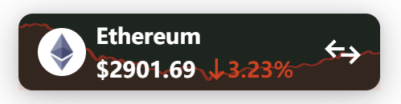
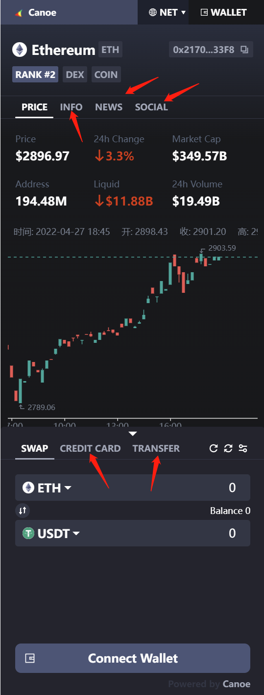

# Guild

## Introducing canoe resources

```html
<script type="module" src="https://dex.canoe.finance/build/app.esm.js"></script>
<script nomodule src="https://dex.canoe.finance/build/app.js"></script>
```

## Insert canoe DEX tag in HTML

```html
<canoe-dex
   id="[YOUR_ID]"
   token="Ethereum"
   modules="['Info', 'News', 'Social', 'Credit-Card', 'Transfer']"
></canoe-dex>
```

## Full example code

```html
<!DOCTYPE html>
<html lang="en">
  <head>
    <script type="module" src="https://dex.canoe.finance/build/app.esm.js"></script>
    <script nomodule src="https://dex.canoe.finance/build/app.js"></script>
  </head>
  <body>
    <canoe-dex
      id="[YOUR_ID]"
      token="Ethereum"
      modules="['Info', 'News', 'Social', 'Credit-Card', 'Transfer']"
    ></canoe-dex>
  </body>
</html>
```

### id

First, you need to apply for id, It will be related to your profit sharing ratio. If it is not filled in, it will be transferred to canoe Treasury by default.

### token

Token name of thumbnail, It will show price, rise and  simple kline.



### modules

Modular configuration. If it is not filled in, all functional modules will be included by default.
The module includes: 'Info', 'News', 'Social', 'Credit-Card', 'Transfer'


